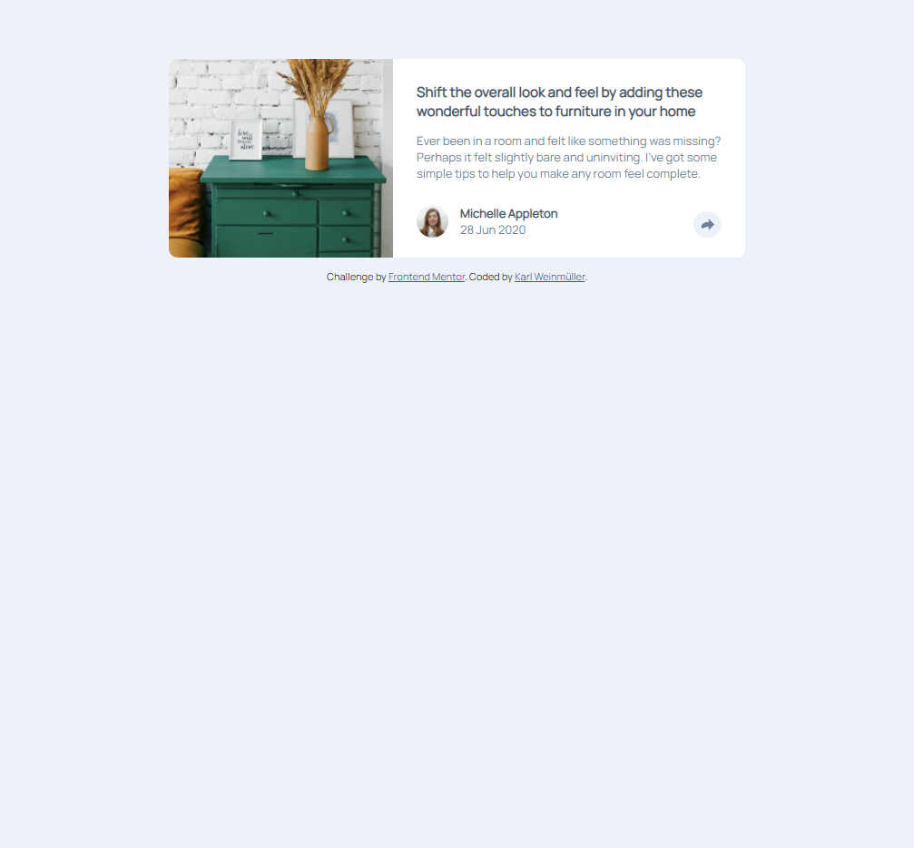
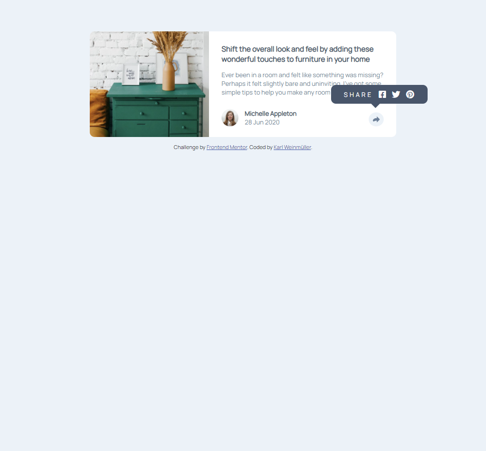
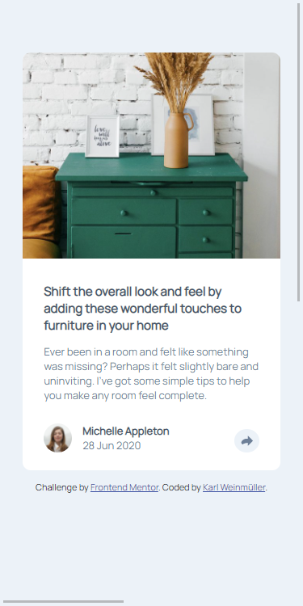
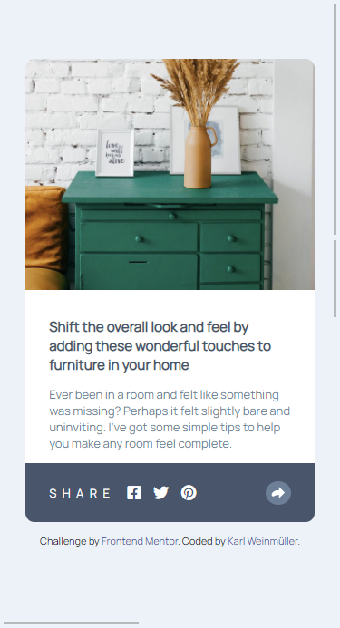

# Frontend Mentor - Article preview component solution

This is a solution to the [Article preview component challenge on Frontend Mentor](https://www.frontendmentor.io/challenges/article-preview-component-dYBN_pYFT). Frontend Mentor challenges help you improve your coding skills by building realistic projects. 

## Table of contents

- [Overview](#overview)
  - [The challenge](#the-challenge)
  - [Screenshot](#screenshot)
  - [Links](#links)
- [My process](#my-process)
  - [Built with](#built-with)
- [Author](#author)

## Overview

### The challenge

- Build out the project to the designs provided

### Screenshot

### Links

- Solution URL: [https://github.com/Karl-afk/article-preview-component-master](https://github.com/Karl-afk/article-preview-component-master)
- Live Site URL: [https://karl-afk.github.io/article-preview-component-master](https://karl-afk.github.io/article-preview-component-master)

### Built with

- Semantic HTML5 markup
- CSS custom properties
- Flexbox
- Mobile-first workflow
- SASS

## Author

- Website - [Karl Weinmüller](www.karlweinmueller.de)
- Frontend Mentor - [@karl-afk](https://www.frontendmentor.io/profile/karl-afk)
